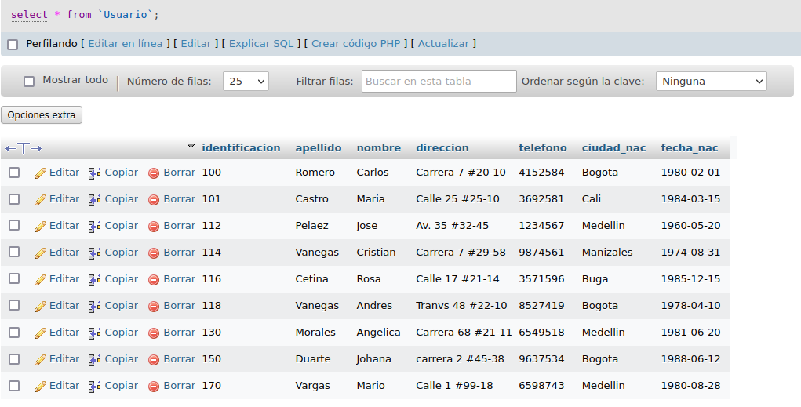
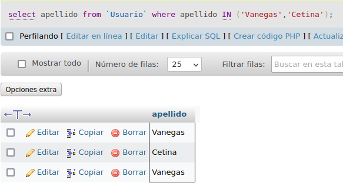
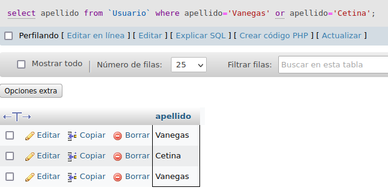

# Consultas1-SQL

#CONSULTA SQL

## Tabla usuario

## COMANDO SELECT

1. Para visualizar toda la información que contiene la tabla `usuario` se puede incluir con la instrucción SELECT el carcter '*' o cada uno de los campos de la tabla 

`select * from usuario`

2. Visualzar solamente la identificación del usuario

`select identificación from usuario`

3. si se desea obtener ls registros cuya identificación sean mayores o iguales a 150; se debe utilizar la clausula WHERE que especifica las condiciones que deben los registros que se van a seleccionar.

`SELECT * FROM Usuario WHERE Identificacion>=150`

4. Si se desea obtener los rgistros cuyo sus apellidos sean Vanegas o Cetina, se debe utilizar el operador IN que especifica los registros que se quieren visualizar en la tabla

`select apellidos from Usuario where apellidos IN('Vanegas', 'Cetina')`

O se puede utilizar el operador OR

`select apellido from Usuario where apellido='Vanegas' or apellido='Cetina'`

5. Si se desea obtener los registros cuya identificación sea menor a 110 y la ciudad sea Cali se debe utilizar el operador AND.

`select * from Usuario where identificacion<'150' and ciudad_nac='Cali'`

6. Si se desa obtener los registros cuyos nombres empiecen por la letra a, sebe utilizar l operador LIKE que utiliza los patrones "%" (todos) y '_' (caracter)

`select * from Usuario where nombre LIKE 'A%'`

7. Se desea obtener los registros cuyos nombres tengan la letra a 

`select * from Usuario where nombre LIKE '%a%'`

8. Si se desea obtener los regisro donde la cuarta letra de nomre sea una a

`select * from Usuario where nombre LIKE '___a%'`

9. Si se desea obtener los registros cuya identificación este entre el intervalo 110 y 150, se debe utilizar la clausula BETWEEN, que sirve para especificr un intervalo de valores

`select * from Usuario where identificacion BETWEEN '110' and '150'`

## COMANDO DELETE

10. Para eleminar solamente los registros cuya identificación sea mayor de 130 

`delete from Usuario where identficacion>'130'`

11. Para actualizar la ciudad de nacimiento de Cristian Vanegas cuya identificación es 114

`update Usuario set ciudad_nac = 'Manisalez' where identificacion='114'`

## Tabla pedidos

12. Para visualizar los campos identificación, nombre, appelidos, de la tabla usuario y nropedido,fechacomprar,fechavencimiento  observación de la tabla pedidos se debe realizar la siguiente intrución sql:

`select usuario.identificacion, usuario.nombre, usuario.apellido, pedidos.Nropedido, pedidos.fechacompra, pedidos.fechavence, pedidos.observacion from usuario inner join pedidos on usuario.identificacion = pedidos.identifiacion`

13. Para visualizar todos los capos de las tablas usuarios y pedidos donde identificacion sea mayor que 100, se debe reaizar la sigueiente instrucción:

`select usuario.*, pedidos.* from usuarios inner join pedidos on usuarios identificacion = pedidos.identificacion where usurio.identificacion > 100`

